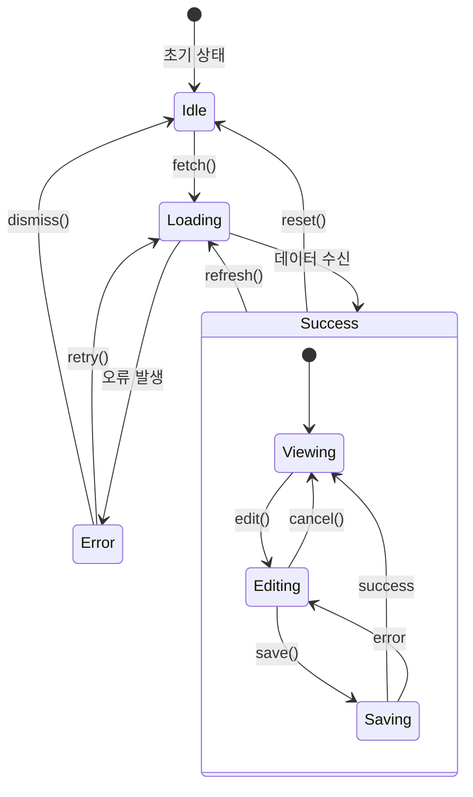
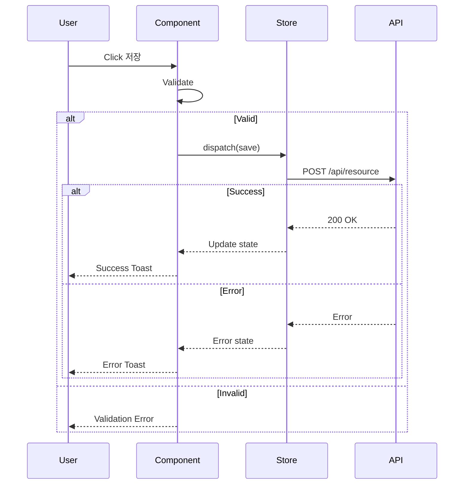

# /ui-design - 상세 가이드

> 이 문서는 필요 시 참조하는 상세 가이드입니다.

---

## 멀티 LLM 3-Way Cross Validation

### Phase 1: 병렬 분석 (필수)

세 개의 LLM이 동시에 분석을 수행합니다.

#### Claude 분석 (Design Lead)

Claude가 직접 수행:

```markdown
## UI 설계 분석

### 분석 영역
1. 컴포넌트 구조 및 계층
2. UI 표준 준수 여부
3. Responsive 설계 적합성
4. 화면 흐름 완전성

### 분석 결과
- 컴포넌트 구조: {분석}
- UI 표준 매핑: {분석}
- 반응형 전략: {분석}
- 개선 제안: {목록}
```

#### GPT-5.2 프롬프트 (Technical Validator)

mcp__zen__chat 호출:

```
당신은 React/TypeScript UI 기술 전문가입니다.

다음 UI 설계를 기술적 관점에서 분석하세요:
{01-requirements.md 내용}
{Claude의 컴포넌트 설계 초안}

분석 항목:
1. 렌더링 성능 최적화
   - React.memo 적용 필요 컴포넌트
   - useMemo/useCallback 적용점
   - 불필요한 리렌더링 위험

2. 상태 관리 패턴
   - 전역 vs 로컬 상태 구분
   - Context API vs Zustand 권장
   - 상태 구조 최적화

3. 번들 사이즈 영향
   - 대형 라이브러리 의존성
   - 코드 스플리팅 필요 여부
   - Tree-shaking 가능성

4. 컴포넌트 재사용성 점수 (1-5)
   - 추상화 수준 적절성
   - Props 인터페이스 설계
   - 합성 패턴 활용

결과를 다음 형식으로 출력:
| 항목 | 분석 | 권장사항 | 우선순위 |
|------|------|---------|---------|
```

#### Gemini-3-Pro 프롬프트 (UX/A11y Validator)

mcp__zen__chat 호출:

```
당신은 UX/접근성 전문가입니다.

다음 UI 설계를 사용자 경험 관점에서 분석하세요:
{01-requirements.md 내용}
{Claude의 컴포넌트 설계 초안}

분석 항목:
1. WCAG 2.1 AA 준수
   - 색상 대비 (4.5:1 이상)
   - 키보드 네비게이션
   - 스크린 리더 호환성
   - Focus 관리

2. 모바일 터치 타겟
   - 44x44px 최소 크기
   - 터치 영역 간격
   - 제스처 지원

3. 2025-2026 UI 트렌드 반영
   - Glass Morphism
   - Micro-interactions
   - Dark Mode 지원
   - Spatial Design

4. 사용자 인지 부하 (1-5)
   - 정보 밀도
   - 시각적 계층
   - 인터랙션 복잡도

결과를 다음 형식으로 출력:
| 항목 | 분석 | 권장사항 | 우선순위 |
|------|------|---------|---------|
```

---

### Phase 2: Cross Validation Matrix

3개 LLM 결과를 종합하여 Matrix를 생성합니다.

#### 템플릿

```markdown
## 3-Way Cross Validation Matrix

### 분석 결과 종합

| 검증 영역 | Claude | GPT-5.2 | Gemini-3-Pro | 합의 |
|----------|--------|---------|--------------|------|
| 컴포넌트 구조 | {결과} | {결과} | {결과} | {공통/채택/상충} |
| 성능 최적화 | - | {결과} | - | GPT 채택 |
| 상태 관리 | {결과} | {결과} | - | {공통/채택/상충} |
| 접근성 | {결과} | - | {결과} | {공통/채택/상충} |
| 반응형 설계 | {결과} | {결과} | {결과} | {공통/채택/상충} |
| 트렌드 반영 | {결과} | - | {결과} | GEM 채택 |

### 공통 의견 (자동 채택)
- {의견 1}
- {의견 2}

### 상충 의견 (해결 필요)
| 항목 | Claude | GPT | Gemini | 상충 내용 |
|------|--------|-----|--------|----------|
| {항목} | {의견} | {의견} | {의견} | {설명} |
```

---

### 개발자 확인 프로세스

Phase 2 완료 후 개발자에게 확인합니다.

#### 확인 프롬프트 (AskUserQuestion)

```markdown
## Round 1 분석 완료

### Cross Validation Matrix 요약
| 영역 | 주요 발견 | 상충 여부 |
|------|----------|----------|
| 설계 (Claude) | {핵심 1-2문장} | ⚠️ 있음 / ✅ 없음 |
| 기술 (GPT) | {핵심 1-2문장} | ⚠️ 있음 / ✅ 없음 |
| UX (Gemini) | {핵심 1-2문장} | ⚠️ 있음 / ✅ 없음 |

### 2라운드 진행 여부
역할 반전 비판을 통해 각 분석의 약점을 추가 검증할 수 있습니다.

선택:
[A] 전체 진행 - 모든 영역 비판 (권장: 상충 있을 때)
[B] 특정 영역만 - 상충 있는 영역만 선택
[C] 스킵 - 현재 결과로 진행
```

#### 선택별 처리

| 선택 | LLM 호출 | 처리 |
|------|---------|------|
| **[A] 전체 진행** | +3회 (총 6회) | GPT→설계비판, Gemini→기술비판, Claude→UX비판 |
| **[B] 특정 영역** | +1~2회 | 선택된 영역만 비판 진행 |
| **[C] 스킵** | 0회 | Round 1 결과로 바로 Phase 3 |

---

### Phase 2.5: 역할 반전 피드백 (선택적)

개발자가 [A] 또는 [B]를 선택한 경우 실행합니다.

#### 실행 흐름 (Claude 주도)

```
1. Claude가 Round 1 결과 3개를 종합
2. 각 영역별 비판 프롬프트 생성
3. GPT/Gemini에 병렬 전달 (mcp__zen__chat)
4. Claude가 자체적으로 UX 비판 수행
5. 3개 비판 결과 종합하여 최종 반영
```

#### 역할 반전 매핑

| Round 1 역할 | Round 2 역할 (반전) | 비판 대상 |
|-------------|-------------------|----------|
| Claude (설계) | → **GPT가 설계 비판** | Claude의 설계 분석 |
| GPT (기술) | → **Gemini가 기술 비판** | GPT의 기술 분석 |
| Gemini (UX) | → **Claude가 UX 비판** | Gemini의 UX 분석 |

#### GPT에게 전달 (설계 비판 프롬프트)

```
당신은 Devil's Advocate입니다.
아래 UI 설계 분석 결과를 비판적 시각에서 검토하세요.

[Claude의 UI 설계 분석 결과]
{Claude Round 1 결과}

질문:
1. 이 컴포넌트 구조에서 간과한 기술적 위험은?
2. 실제 구현 시 발생할 설계 문제점은?
3. 더 나은 컴포넌트 구조 대안이 있다면?
4. 이 설계가 성능에 미칠 부정적 영향은?

반드시 건설적 비판과 구체적 개선안을 함께 제시하세요.

결과를 다음 형식으로 출력:
| 비판 항목 | 문제점 | 개선안 | 심각도 |
|----------|--------|--------|--------|
```

#### Gemini에게 전달 (기술 비판 프롬프트)

```
당신은 Devil's Advocate입니다.
아래 기술 분석 결과를 비판적 시각에서 검토하세요.

[GPT의 기술 분석 결과]
{GPT Round 1 결과}

질문:
1. 이 성능 최적화 분석에서 놓친 UX 관점 문제는?
2. 사용자 경험에 부정적 영향을 줄 수 있는 기술 결정은?
3. 더 사용자 친화적인 기술 대안이 있다면?
4. 접근성 관점에서 이 기술 결정의 문제점은?

반드시 건설적 비판과 구체적 개선안을 함께 제시하세요.

결과를 다음 형식으로 출력:
| 비판 항목 | 문제점 | 개선안 | 심각도 |
|----------|--------|--------|--------|
```

#### Claude 자체 수행 (UX 비판)

```markdown
## UX 분석 비판 (Claude)

[Gemini의 UX/접근성 분석 결과]를 기술적 관점에서 재검토합니다.

### 질문
1. 이 접근성 권장사항 중 구현이 어려운 것은?
2. 성능과 트레이드오프가 있는 UX 권장사항은?
3. 현실적으로 조정이 필요한 부분은?
4. 프로젝트 기술 스택과 충돌하는 권장사항은?

### 비판 결과
| 비판 항목 | 문제점 | 개선안 | 심각도 |
|----------|--------|--------|--------|
```

#### 역할 반전 결과 통합

```markdown
## Round 2 비판 결과 종합

### 설계 비판 (GPT → Claude 설계)
{GPT 비판 결과 요약}

### 기술 비판 (Gemini → GPT 기술)
{Gemini 비판 결과 요약}

### UX 비판 (Claude → Gemini UX)
{Claude 비판 결과 요약}

### 반영 사항
| 비판 항목 | 원래 결정 | 비판 내용 | 최종 결정 | 변경 여부 |
|----------|----------|----------|----------|----------|
```

---

### Phase 3: Feedback Loop

상충 의견을 해결하고 최종 판단을 내립니다.

#### 상충 해결 기록

```markdown
## 상충 해결 기록

| 항목 | Claude | GPT | Gemini | 최종 결정 | 근거 |
|------|--------|-----|--------|----------|------|
| 상태관리 | Context | Zustand | Redux | Zustand | 번들 사이즈, 학습곡선 |
| 그리드 가상화 | 필수 | 선택 | 필수 | 필수 | 100+ 항목 예상 |

### 결정 근거 상세

#### 상태관리: Zustand 채택
- **Claude 의견**: Context API로 충분
- **GPT 의견**: Zustand 권장 (DevTools, 성능)
- **Gemini 의견**: Redux 권장 (대규모 앱)
- **최종 결정**: Zustand
- **근거**:
  - 번들 사이즈 최소 (1.2KB)
  - 학습 곡선 낮음
  - DevTools 지원
  - 현재 규모에 적합
```

---

### Phase 4: Visual Prototype

시각적 프로토타입을 생성합니다.

#### ASCII Layout Diagram 표준

```
┌─────────────────────────────────────────────────────────────┐
│ Header [sticky, h:60px]                        [UserMenu]   │
│ ┌─────────┐ ┌─────────────────────────────────────────────┐│
│ │ Logo    │ │ Navigation                                  ││
│ └─────────┘ └─────────────────────────────────────────────┘│
├──────────────┬──────────────────────────────────────────────┤
│ Sidebar      │ Main Content                                 │
│ [w:240px]    │                                              │
│ [collapsible]│ ┌──────────────────────────────────────────┐│
│              │ │ Page Header                              ││
│ ┌──────────┐ │ │ Title + Actions                          ││
│ │ NavGroup │ │ └──────────────────────────────────────────┘│
│ │ • Item 1 │ │                                              │
│ │ • Item 2 │ │ ┌──────────────────────────────────────────┐│
│ │ • Item 3 │ │ │ Filter Bar                               ││
│ └──────────┘ │ │ [SearchInput] [DateRange] [Status]       ││
│              │ └──────────────────────────────────────────┘│
│ ┌──────────┐ │                                              │
│ │ NavGroup │ │ ┌──────────────────────────────────────────┐│
│ │ • Item 4 │ │ │ DataGrid [virtualized, h:calc]           ││
│ │ • Item 5 │ │ │ • Column 1 [sortable]                    ││
│ └──────────┘ │ │ • Column 2 [filterable]                  ││
│              │ │ • Column 3                                ││
│              │ │ • Actions [edit, delete]                  ││
│              │ └──────────────────────────────────────────┘│
│              │                                              │
│              │ ┌──────────────────────────────────────────┐│
│              │ │ Pagination                                ││
│              │ └──────────────────────────────────────────┘│
├──────────────┴──────────────────────────────────────────────┤
│ Footer [optional]                                           │
└─────────────────────────────────────────────────────────────┘

Legend:
[sticky] - position: sticky
[w:Npx] - width: Npx
[h:Npx] - height: Npx
[collapsible] - 접기/펼치기 가능
[virtualized] - 가상화 적용
[sortable] - 정렬 가능
[filterable] - 필터 가능
```

#### Mermaid State Flow 표준



#### Mermaid Event Flow 표준



---

## 산출물 구조

```markdown
# UI 설계서: {기능명}

## 1. 멀티 LLM 분석 결과

### 1.1 Cross Validation Matrix
{Matrix 표}

### 1.2 상충 해결 기록
{해결 기록 표}

### 1.3 역할 반전 피드백 (해당 시)
{피드백 결과}

## 2. 화면 목록

| ID | 화면명 | 경로 | 설명 |
|----|--------|------|------|
| SCR-001 | ... | /path | ... |
| SCR-002 | ... | /path | ... |

## 3. 화면별 상세 설계

### SCR-001: {화면명}

#### 3.1.1 ASCII Layout
{ASCII 다이어그램}

#### 3.1.2 컴포넌트 구성

| 컴포넌트 | UI 표준 참조 | Props | 비고 |
|----------|--------------|-------|------|
| Button | Button.Primary | label, onClick | ... |
| Input | Input.Text | value, onChange | ... |
| Table | Table.Standard | columns, data | ... |

#### 3.1.3 상태 정의

| 상태 | 타입 | 초기값 | 설명 |
|------|------|--------|------|
| isLoading | boolean | false | 로딩 상태 |
| data | T[] | [] | 목록 데이터 |
| error | string | null | 에러 메시지 |

#### 3.1.4 이벤트 흐름

| 이벤트 | 트리거 | 액션 | 결과 |
|--------|--------|------|------|
| onSubmit | 버튼 클릭 | API 호출 | 성공/실패 처리 |
| onChange | 입력 변경 | 상태 업데이트 | UI 반영 |

## 4. State Flow Diagram

{Mermaid stateDiagram}

## 5. Event Flow Diagram

{Mermaid sequenceDiagram}

## 6. 컴포넌트 계층 구조

```
pages/
└── {기능명}/
    ├── index.tsx (SCR-001)
    ├── [id].tsx (SCR-002)
    └── components/
        ├── {기능명}List.tsx
        ├── {기능명}Form.tsx
        └── {기능명}Detail.tsx
```

## 7. 상호작용 정의

### 7.1 화면 전환 흐름

```
[SCR-001] --목록 클릭--> [SCR-002]
[SCR-002] --저장--> [SCR-001]
[SCR-002] --취소--> [SCR-001]
```

### 7.2 에러 처리 UI

| 에러 유형 | UI 표현 | 사용자 액션 |
|----------|---------|-------------|
| 네트워크 | Toast 경고 | 재시도 버튼 |
| 유효성 | 필드 에러 | 수정 후 재시도 |
| 권한 | 모달 알림 | 로그인 이동 |

## 8. 반응형 설계

| 브레이크포인트 | 변경사항 |
|---------------|----------|
| Desktop (≥1024px) | 2컬럼 레이아웃 |
| Tablet (768-1023px) | 1컬럼, 사이드바 토글 |
| Mobile (<768px) | 1컬럼, 하단 네비게이션 |

## 9. 접근성 고려사항

| 항목 | 구현 방법 |
|------|----------|
| 키보드 네비게이션 | Tab 순서, Enter/Space 액션 |
| 스크린 리더 | aria-label, role 속성 |
| 색상 대비 | WCAG AA 기준 충족 |
| 터치 타겟 | 44x44px 이상 |

## 10. 기술적 권장사항 (GPT-5.2)

| 항목 | 권장사항 | 우선순위 |
|------|---------|---------|
| 성능 최적화 | {내용} | 높음/중간/낮음 |
| 상태 관리 | {내용} | 높음/중간/낮음 |
| 번들 사이즈 | {내용} | 높음/중간/낮음 |

## 11. UX 권장사항 (Gemini-3-Pro)

| 항목 | 권장사항 | 우선순위 |
|------|---------|---------|
| 접근성 | {내용} | 높음/중간/낮음 |
| 트렌드 반영 | {내용} | 높음/중간/낮음 |
| 인지 부하 | {내용} | 높음/중간/낮음 |
```

---

## Quality Validation

산출물 생성 후 다음 기준으로 내용 품질을 자체 검증한다.
기준 미달 시 자동 개선 후 재검증한다.

### 멀티 LLM 검증

| 검증 항목 | 기준 | 미달 시 조치 |
|----------|------|-------------|
| Cross Validation Matrix | 3개 LLM 결과 모두 포함 | 누락 LLM 재호출 |
| 상충 해결 기록 | 모든 상충에 근거 명시 | 근거 추가 |
| 역할 반전 결과 | 개발자 선택 시 포함 | 결과 추가 |

### 시각적 프로토타입 검증

| 검증 항목 | 기준 | 미달 시 조치 |
|----------|------|-------------|
| ASCII Layout | 모든 화면에 포함 | 누락 화면 추가 |
| Mermaid State Flow | 최소 1개 포함 | 다이어그램 추가 |
| Mermaid Event Flow | 복잡한 흐름에 포함 | 다이어그램 추가 |

### 컴포넌트 매핑 검증

| 검증 항목 | 기준 | 미달 시 조치 |
|----------|------|-------------|
| UI 표준 참조 | 모든 컴포넌트가 UI_STANDARD.md 참조 | 표준 컴포넌트 매핑 추가 |
| 새 컴포넌트 | Provisional로 명시 | 미표시 항목 Provisional 처리 |
| Props 정의 | 모든 컴포넌트에 Props 명시 | 누락 Props 추가 |

### 상태 관리 검증

| 검증 항목 | 기준 | 미달 시 조치 |
|----------|------|-------------|
| 초기값 정의 | 모든 상태에 초기값 | 초기값 추가 |
| 타입 명시 | TypeScript 타입 정의 | 타입 추가 |
| 상태 중복 | 불필요한 중복 상태 없음 | 통합 또는 제거 |

### 화면 흐름 검증

| 검증 항목 | 기준 | 미달 시 조치 |
|----------|------|-------------|
| 진입점 명확 | 각 화면 진입 경로 정의 | 경로 추가 |
| 이탈점 명확 | 화면 종료 후 이동 경로 | 경로 추가 |
| 에러 처리 | 모든 에러에 UI 대응 | 에러 UI 추가 |

### 접근성 검증

| 검증 항목 | 기준 | 미달 시 조치 |
|----------|------|-------------|
| 키보드 접근 | 모든 인터랙션 키보드 가능 | 키보드 지원 추가 |
| ARIA 속성 | 동적 UI에 ARIA 명시 | 속성 추가 |
| 터치 타겟 | 44x44px 이상 | 크기 조정 |

---

## Provisional 컴포넌트 등록

UI 표준에 없는 새 컴포넌트 발견 시:

1. `[PROVISIONAL]` 태그 붙여 문서에 기록
2. Gate 7에서 일괄 승인 요청
3. 승인 시 UI_STANDARD.md에 추가

### 예시

```markdown
| 컴포넌트 | UI 표준 참조 | Props | 비고 |
|----------|--------------|-------|------|
| NotificationBadge | [PROVISIONAL] | count, color | 새 컴포넌트 제안 |
| EditableGrid | [PROVISIONAL] | columns, data, onEdit | 인라인 편집 그리드 |
```

---

## Provisional 트렌드 등록

UI 표준에 없는 새 트렌드 발견 시:

1. `[NEW TREND]` 태그 붙여 문서에 기록
2. Gate 7에서 일괄 승인 요청
3. 승인 시 UI_STANDARD.md 섹션 9~12에 추가

### 예시

```markdown
### 적용 트렌드
| 트렌드 | 적용 영역 | 비고 |
|--------|----------|------|
| Bento Grid Layout | 대시보드 | [NEW TREND] 2026 트렌드 |
| Kinetic Typography | 헤더 | [NEW TREND] 모션 텍스트 |
```
