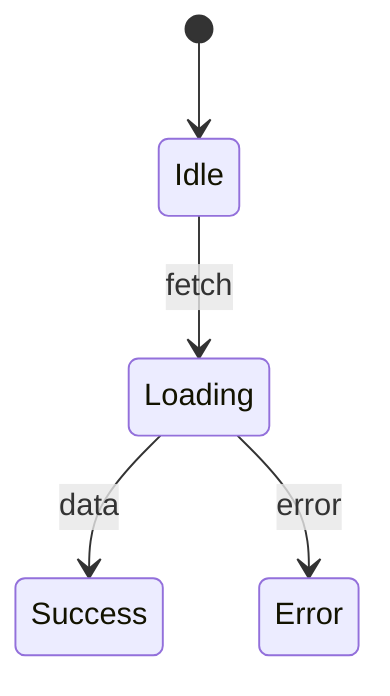

# /ui-design - UI 설계 Skill

## 개요

요구사항을 UI 설계로 변환하는 전문가 Skill입니다. **필수 멀티 LLM 3-Way Cross Validation**과 **역할 반전 피드백**을 통해 고품질 UI 설계를 생성합니다.

## 사용법

```
/ui-design [기능명]
```

## 입출력

- **입력**: `prd/{기능명}/00-research.md`, `01-requirements.md`
- **산출물**: `prd/{기능명}/02-ui-design.md`
- **참조**: `docs/ui-standards/UI_STANDARD.md`

---

## 🔴 필수 실행 체크리스트

실행 전 반드시 확인:

```
□ 1. UI_STANDARD.md 전체 읽기 (SKIP 금지!)
□ 2. 디자인 컨셉 확인 (Liquid Glass, Spatial Depth)
□ 3. 사용 가능한 표준 컴포넌트 파악
□ 4. 멀티 LLM 3-Way 분석 실행 (필수!)
□ 5. Cross Validation Matrix 생성
□ 6. 개발자에게 2라운드(역할 반전) 진행 여부 확인
□ 7. 신규 컴포넌트 → [PROVISIONAL] 태그
□ 8. 신규 트렌드 → [NEW TREND] 태그
□ 9. Visual Prototype (ASCII + Mermaid) 작성
□ 10. Quality Validation 수행
□ 11. Gate 2 검증 항목 19개 확인
```

---

## 5단계 워크플로우

```
┌─────────────────────────────────────────────────────────────┐
│  Phase 1: Parallel Analysis (병렬 분석) - 필수              │
│  ┌─────────────┐ ┌─────────────┐ ┌─────────────────┐        │
│  │   Claude    │ │   GPT-5.2   │ │ Gemini-3-Pro    │        │
│  │ (Design Lead)│ │ (Technical) │ │ (UX/A11y)       │        │
│  └─────────────┘ └─────────────┘ └─────────────────┘        │
└─────────────────────────────────────────────────────────────┘
                            ↓
┌─────────────────────────────────────────────────────────────┐
│  Phase 2: Cross Validation Matrix 생성                      │
│  • 공통 의견 자동 채택                                        │
│  • 상충 의견 식별                                            │
└─────────────────────────────────────────────────────────────┘
                            ↓
┌─────────────────────────────────────────────────────────────┐
│  💬 개발자 확인: "2라운드(역할 반전) 진행할까요?"            │
│  [A] 전체 진행  [B] 특정 영역만  [C] 스킵                   │
└─────────────────────────────────────────────────────────────┘
                            ↓
┌─────────────────────────────────────────────────────────────┐
│  Phase 2.5: Role Reversal (선택적)                          │
│  • GPT → 설계 비판 | Gemini → 기술 비판 | Claude → UX 비판  │
└─────────────────────────────────────────────────────────────┘
                            ↓
┌─────────────────────────────────────────────────────────────┐
│  Phase 3: Feedback Loop - 상충 해결, 최종 판단              │
└─────────────────────────────────────────────────────────────┘
                            ↓
┌─────────────────────────────────────────────────────────────┐
│  Phase 4: Visual Prototype                                  │
│  • ASCII Layout Diagram                                      │
│  • Mermaid State/Event Flow                                  │
└─────────────────────────────────────────────────────────────┘
```

---

## Gate 2 검증 항목 (19개)

### 기존 항목 (11개)

| # | 항목 | 기준 |
|---|------|------|
| 1 | Persona-화면 커버리지 | 모든 Persona 지원 |
| 2 | UC-이벤트 흐름 매핑 | 모든 UC 정의됨 |
| 3 | 컴포넌트 존재 확인 | 표준 또는 PROVISIONAL |
| 4 | 상태 타입 검증 | TS 유효 타입 |
| 5 | 화면 상태 정의 | 로딩/에러/빈 상태 |
| 6 | 폼 검증 규칙 | 필드별 정의 |
| 7 | 이벤트 흐름 완성 | 성공/실패 분기 포함 |
| 8 | 디자인 컨셉 적용 | Glass, Depth 등 |
| 9 | CSS 토큰 매핑 | 변수 사용 |
| 10 | 아이콘 표준 | Lucide React |
| 11 | 모션/인터랙션 | 0.2~0.3s 정의 |

### 추가 항목 (8개) - 멀티 LLM 검증

| # | 항목 | 담당 LLM | 기준 |
|---|------|---------|------|
| 12 | 렌더링 성능 최적화 | GPT-5.2 | memo/useMemo 적용점 식별 |
| 13 | 상태 관리 패턴 | GPT-5.2 | Context/Zustand 적절성 |
| 14 | 번들 사이즈 영향 | GPT-5.2 | 대형 라이브러리 경고 |
| 15 | 컴포넌트 재사용성 | GPT-5.2 | 재사용 점수 (1-5) |
| 16 | WCAG 2.1 AA 준수 | Gemini-3-Pro | 상세 접근성 체크 |
| 17 | 모바일 터치 타겟 | Gemini-3-Pro | 44x44px 이상 |
| 18 | UI 트렌드 반영도 | Gemini-3-Pro | 2025-2026 트렌드 |
| 19 | 사용자 인지 부하 | Gemini-3-Pro | 복잡도 점수 (1-5) |

---

## LLM 역할 분담

| LLM | 역할 | 분석 영역 |
|-----|------|----------|
| **Claude** | Design Lead | 컴포넌트 구조, UI 표준 준수, Responsive 설계 |
| **GPT-5.2** | Technical Validator | 성능 최적화, 상태 관리, 번들 사이즈, 재사용성 |
| **Gemini-3-Pro** | UX/A11y Validator | WCAG 준수, 모바일 UX, 트렌드 반영, 사용자 흐름 |

---

## 개발자 확인 프로세스

Round 1 완료 후 **항상** 개발자에게 확인:

```markdown
## Round 1 분석 완료

### Cross Validation Matrix 요약
| 영역 | 주요 발견 | 상충 여부 |
|------|----------|----------|
| 설계 (Claude) | {요약} | ⚠️/✅ |
| 기술 (GPT) | {요약} | ⚠️/✅ |
| UX (Gemini) | {요약} | ⚠️/✅ |

### 2라운드 진행 여부
[A] 전체 진행 - 모든 영역 비판 (+3회 LLM 호출)
[B] 특정 영역만 - 상충 있는 영역만 선택
[C] 스킵 - 현재 결과로 진행
```

---

## Visual Prototype 필수 산출물

### 1. ASCII Layout Diagram
```
┌─────────────────────────────────────────────┐
│ Header [sticky]                   [Actions] │
├──────────┬──────────────────────────────────┤
│ Sidebar  │ Main Content Area                │
│ [240px]  │ ┌──────────────────────────────┐ │
│          │ │ DataGrid [virtualized]       │ │
│          │ └──────────────────────────────┘ │
└──────────┴──────────────────────────────────┘
```

### 2. Mermaid State Flow


---

## 트렌드 적용 (UI_STANDARD.md 섹션 9~12)

| 기능 특성 | 적용 트렌드 |
|----------|------------|
| 목록 조회 | TanStack Query, 가상화 |
| 실시간 | SSE, 새 항목 알림 |
| CRUD | Optimistic UI |
| 모바일 | Bottom Sheet, Swipe |
| 대량 데이터 | 가상화 필수 (100+) |

---

## Provisional 처리

- **신규 컴포넌트**: `[PROVISIONAL]` 태그 → Gate 7 승인
- **신규 트렌드**: `[NEW TREND]` 태그 → Gate 7 승인

---

## 다음 단계

Gate 2 통과 후 → `/data-model`, `/api-design` 실행

---

> 📖 상세 템플릿, Quality Validation, 멀티 LLM 프롬프트, 역할 반전 템플릿은 `SKILL-detail.md` 참조
