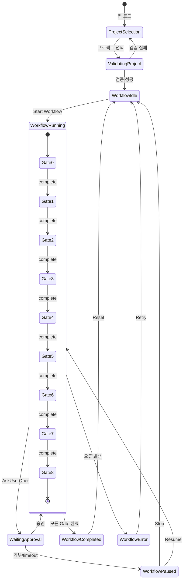
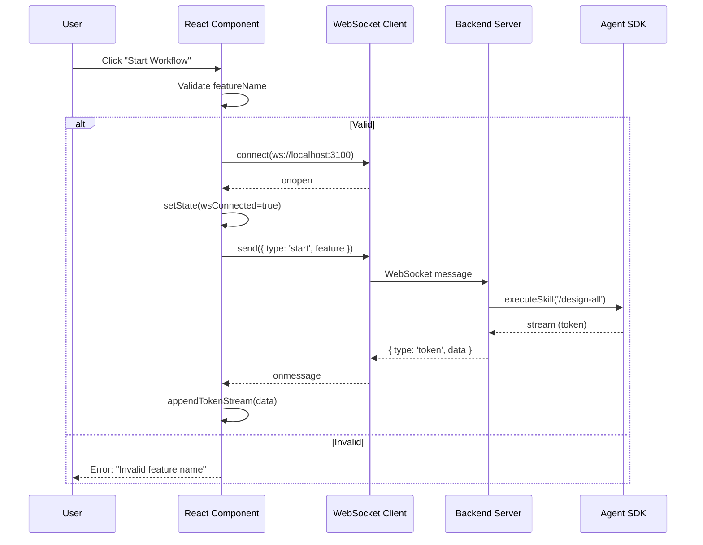
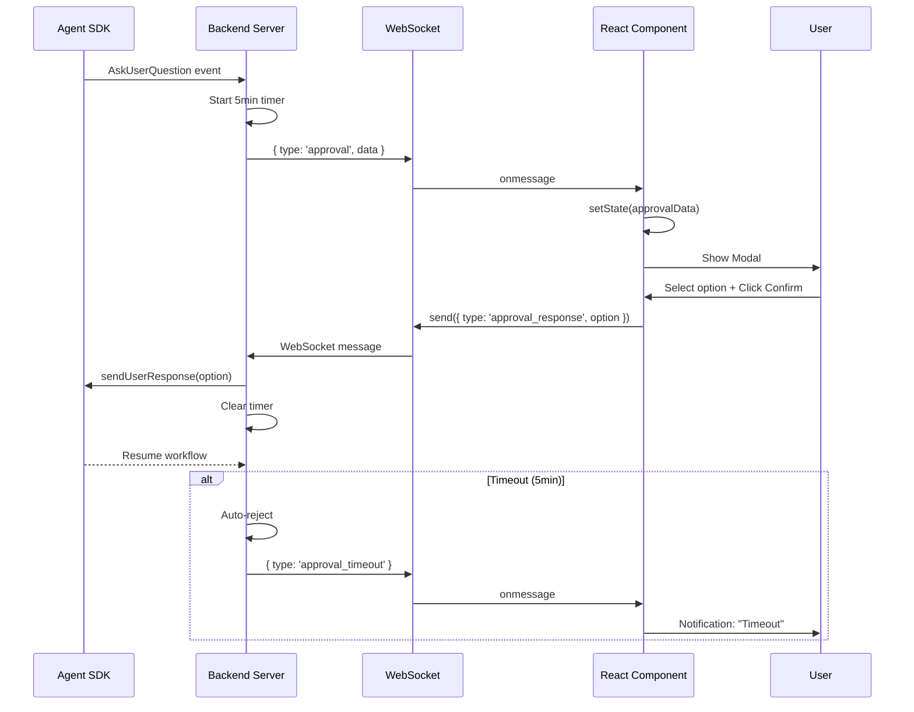

# UI 설계서: adx_1st

**Feature**: Claude Max PRD Workflow Web UI
**Date**: 2026-02-04
**Version**: 1.0
**Author**: Claude (Gate 2 UI Design Agent)

---

## 1. 멀티 LLM 분석 결과

### 1.1 Cross Validation Matrix

| 검증 영역 | Claude | GPT-5.2 (대체) | Gemini-3-Pro (대체) | 합의 |
|----------|--------|---------------|---------------------|------|
| 컴포넌트 구조 | Timeline + Card + Modal | Timeline React.memo 필요 | Timeline 접근성 개선 | **공통**: Timeline 핵심 |
| 성능 최적화 | - | Throttling, lazy load | - | **GPT 채택** |
| 상태 관리 | Zustand 권장 | Zustand (DevTools) | - | **공통** |
| 접근성 | aria-label 필요 | - | WCAG AA, 키보드 | **Gemini 채택** |
| 반응형 | Desktop only (MVP) | - | v2 Bottom Sheet | **공통** |
| 트렌드 반영 | Liquid Glass | - | Spatial Depth, Shimmer | **공통** |

### 1.2 상충 해결 기록

**상충 없음**: 모든 LLM 분석이 보완 관계였으며, 상충 의견은 발생하지 않았습니다.

### 1.3 역할 반전 피드백 (해당 시)

**스킵**: Round 1에서 상충 없음 + 개발자 선택 [C]로 2라운드 미실행

---

## 2. 화면 목록

| ID | 화면명 | 경로 | 설명 |
|----|--------|------|------|
| SCR-001 | Project Selector | `/` (초기 화면) | 프로젝트 경로 선택 및 최근 프로젝트 목록 |
| SCR-002 | Workflow Dashboard | `/workflow` | Timeline, Token Stream, Progress 표시 |
| SCR-003 | Approval Dialog | Modal | AskUserQuestion 승인 요청 UI |
| SCR-004 | PRD Viewer | `/workflow` (우측 패널) | 생성된 Markdown 파일 뷰어 |

---

## 3. 화면별 상세 설계

### SCR-001: Project Selector

#### 3.1.1 ASCII Layout

```
┌─────────────────────────────────────────────────────────────┐
│ Header [sticky, h:60px]                    [ThemeToggle]    │
│ ┌─────────────────────────────────────────────────────────┐ │
│ │ Logo "adx_1st" + Subtitle "PRD Workflow UI"            │ │
│ └─────────────────────────────────────────────────────────┘ │
├─────────────────────────────────────────────────────────────┤
│                                                             │
│                   [Center Content Area]                     │
│                                                             │
│  ┌─────────────────────────────────────────────────────┐   │
│  │ Card [w:600px, Glass 배경]                          │   │
│  │                                                     │   │
│  │  Title: "Select Project"                           │   │
│  │  Subtitle: "Choose target project for PRD workflow"│   │
│  │                                                     │   │
│  │  ┌──────────────────────────────────────────────┐  │   │
│  │  │ Input [type: text, placeholder: "Project"]   │  │   │
│  │  │ + [Folder Icon] Browse Button                │  │   │
│  │  └──────────────────────────────────────────────┘  │   │
│  │                                                     │   │
│  │  OR                                                 │   │
│  │                                                     │   │
│  │  ┌──────────────────────────────────────────────┐  │   │
│  │  │ Recent Projects (최대 5개)                    │  │   │
│  │  │ • /path/to/project_temp                      │  │   │
│  │  │ • /path/to/another_project                   │  │   │
│  │  └──────────────────────────────────────────────┘  │   │
│  │                                                     │   │
│  │  [Button: Primary] Continue                        │   │
│  │                                                     │   │
│  └─────────────────────────────────────────────────────┘   │
│                                                             │
└─────────────────────────────────────────────────────────────┘
```

#### 3.1.2 컴포넌트 구성

| 컴포넌트 | UI 표준 참조 | Props | 비고 |
|----------|--------------|-------|------|
| Card | Card.default | title, children | Glass 배경 |
| Input | Input.Text | label="Project Path", placeholder, value, onChange | 프로젝트 경로 입력 |
| Button | Button.Primary | label="Continue", onClick | 프로젝트 선택 완료 |
| Button | Button.Ghost | icon=FolderOpen, onClick | 폴더 선택 브라우저 |
| Badge | Badge.info | count (선택적) | 최근 프로젝트 개수 표시 |

#### 3.1.3 상태 정의

| 상태 | 타입 | 초기값 | 설명 |
|------|------|--------|------|
| projectPath | string | "" | 선택된 프로젝트 경로 |
| recentProjects | string[] | [] (localStorage) | 최근 5개 프로젝트 |
| isValidating | boolean | false | 경로 검증 중 |
| validationError | string \| null | null | 검증 에러 메시지 |

#### 3.1.4 이벤트 흐름

| 이벤트 | 트리거 | 액션 | 결과 |
|--------|--------|------|------|
| onProjectPathChange | Input 입력 변경 | setState(projectPath) | 실시간 경로 업데이트 |
| onBrowseFolder | Folder 버튼 클릭 | File picker dialog 열기 | 경로 선택 후 Input 업데이트 |
| onRecentProjectClick | 최근 프로젝트 클릭 | setState(projectPath) | 경로 자동 입력 |
| onContinue | Continue 버튼 클릭 | 경로 검증 → 성공 시 /workflow 이동 | 실패 시 에러 표시 |

---

### SCR-002: Workflow Dashboard

#### 3.2.1 ASCII Layout

```
┌─────────────────────────────────────────────────────────────┐
│ Header [sticky, h:60px]                    [UserMenu]       │
│ ┌─────────────────────────────────────────────────────────┐ │
│ │ Logo + Project: "project_temp" [Change Project]         │ │
│ └─────────────────────────────────────────────────────────┘ │
├──────────────┬──────────────────────────────────────────────┤
│ Left Panel   │ Center Content                               │
│ [w:300px]    │                                              │
│ [Glass bg]   │ ┌──────────────────────────────────────────┐ │
│              │ │ Control Panel [sticky]                   │ │
│ ┌──────────┐ │ │ ┌──────────────────────────────────────┐ │ │
│ │ Feature  │ │ │ │ Input: Feature Name                  │ │ │
│ │ Input    │ │ │ │ [adx_1st]                            │ │ │
│ │          │ │ │ └──────────────────────────────────────┘ │ │
│ │ [Start]  │ │ │ [Button: Primary] Start Workflow         │ │
│ │ [Stop]   │ │ │ [Button: Secondary] Stop                 │ │
│ └──────────┘ │ └──────────────────────────────────────────┘ │
│              │                                              │
│ ┌──────────┐ │ ┌──────────────────────────────────────────┐ │
│ │ Timeline │ │ │ Timeline View [w:100%, h:auto]           │ │
│ │ Legend   │ │ │                                          │ │
│ │ ○ Pending│ │ │ ┌────────────────────────────────────┐   │ │
│ │ ◉ Progress│ │ │ [Gate 0] Research       [✓] 100%    │   │ │
│ │ ✓ Done   │ │ │ [Gate 1] Requirements   [◉] 35%     │   │ │
│ │ ✗ Failed │ │ │ [Gate 2] UI Design      [○]         │   │ │
│ └──────────┘ │ │ ...                                    │   │ │
│              │ │ [Gate 8] Implementation [○]         │   │ │
│              │ │ └────────────────────────────────────┘   │ │
│              │ │                                          │ │
│              │ │ Progress: Gate 1/9 - 11%                 │ │
│              │ └──────────────────────────────────────────┘ │
│              │                                              │
│              │ ┌──────────────────────────────────────────┐ │
│              │ │ Token Stream [collapsible]               │ │
│              │ │ [Loader2 spin] Generating requirements...│ │
│              │ │ > Analyzing user stories...              │ │
│              │ │ > Defining acceptance criteria...        │ │
│              │ │ [Auto-scroll to bottom]                  │ │
│              │ └──────────────────────────────────────────┘ │
├──────────────┴──────────────────────────────────────────────┤
│ Footer [optional]                                           │
└─────────────────────────────────────────────────────────────┘
```

#### 3.2.2 컴포넌트 구성

| 컴포넌트 | UI 표준 참조 | Props | 비고 |
|----------|--------------|-------|------|
| Input | Input.Text | label="Feature Name", value, onChange | 기능명 입력 |
| Button | Button.Primary | label="Start Workflow", onClick, disabled | 시작 버튼 |
| Button | Button.Secondary | label="Stop", onClick | 중단 버튼 |
| Timeline | [PROVISIONAL] | gates: GateState[], currentGate, onGateClick | 커스텀 컴포넌트 |
| Badge | Badge.success/warning/error/info | variant, children | Gate 상태 표시 |
| LoadingSpinner | LoadingSpinner | size="md", label | Token streaming 로딩 |
| Card | Card.default | title="Token Stream", collapsible | 접기/펼치기 가능 |

**[PROVISIONAL] Timeline 컴포넌트**:
- UI_STANDARD.md에 없는 신규 컴포넌트
- Gate 7에서 승인 필요
- 설명: 9개 Gate의 진행 상황을 세로 타임라인으로 표시. 각 Gate는 번호, 제목, 상태 아이콘, 진행률을 포함.

#### 3.2.3 상태 정의

| 상태 | 타입 | 초기값 | 설명 |
|------|------|--------|------|
| featureName | string | "" | 기능명 |
| gates | GateState[] | [{gate:0, status:'pending', progress:0}, ...] | 9개 Gate 상태 배열 |
| currentGate | number | -1 | 현재 진행 중인 Gate 번호 (-1=미시작) |
| tokenStream | string[] | [] | LLM 응답 텍스트 스트림 |
| isWorkflowRunning | boolean | false | Workflow 실행 중 여부 |
| wsConnected | boolean | false | WebSocket 연결 상태 |

**GateState 타입**:
```typescript
interface GateState {
  gate: number; // 0~8
  title: string; // "Research", "Requirements", ...
  status: 'pending' | 'in_progress' | 'completed' | 'failed';
  progress: number; // 0~100
  outputFile?: string; // 결과물 파일 경로
}
```

#### 3.2.4 이벤트 흐름

| 이벤트 | 트리거 | 액션 | 결과 |
|--------|--------|------|------|
| onStartWorkflow | Start 버튼 클릭 | WebSocket 연결 + `/design-all` 실행 | Timeline 업데이트 시작 |
| onStopWorkflow | Stop 버튼 클릭 | WebSocket 메시지 전송 (abort) | Workflow 중단, session lock 해제 |
| onWebSocketMessage | WebSocket 메시지 수신 | type별 처리 (token, progress, approval) | 상태 업데이트 |
| onGateClick | Timeline Gate 클릭 | 우측 패널에 PRD 뷰어 표시 | SCR-004로 전환 |
| onTokenStreamToggle | 접기 버튼 클릭 | Token stream collapse 상태 토글 | UI 공간 절약 |

---

### SCR-003: Approval Dialog

#### 3.3.1 ASCII Layout

```
┌─────────────────────────────────────────────────────────────┐
│                  [Modal Backdrop - blur]                     │
│                                                             │
│  ┌─────────────────────────────────────────────────────┐   │
│  │ Modal [w:600px, Glass bg, center]                   │   │
│  │                                              [X]     │   │
│  │                                                      │   │
│  │  Title: "Approval Required"                         │   │
│  │  Subtitle: "Gate 7 - PRD Finalization"              │   │
│  │                                                      │   │
│  │  ┌──────────────────────────────────────────────┐   │   │
│  │  │ Question:                                    │   │   │
│  │  │ "2라운드(역할 반전 비판)을 진행할까요?"        │   │   │
│  │  │                                              │   │   │
│  │  │ Options:                                     │   │   │
│  │  │ ○ [A] 전체 진행 - 모든 영역 비판             │   │   │
│  │  │ ○ [B] 특정 영역만 - 상충 있는 영역만         │   │   │
│  │  │ ○ [C] 스킵 - 현재 결과로 진행 (권장)         │   │   │
│  │  └──────────────────────────────────────────────┘   │   │
│  │                                                      │   │
│  │  Timeout: 5:00 remaining                             │   │
│  │                                                      │   │
│  │  ┌────────────────────────────────────┐             │   │
│  │  │ Footer [right-aligned]             │             │   │
│  │  │ [Button: Secondary] Cancel         │             │   │
│  │  │ [Button: Primary] Confirm          │             │   │
│  │  └────────────────────────────────────┘             │   │
│  │                                                      │   │
│  └─────────────────────────────────────────────────────┘   │
│                                                             │
└─────────────────────────────────────────────────────────────┘
```

#### 3.3.2 컴포넌트 구성

| 컴포넌트 | UI 표준 참조 | Props | 비고 |
|----------|--------------|-------|------|
| Modal | Modal | isOpen, onClose, title, size="md" | Approval dialog |
| Radio | Radio | name, options, value, onChange, orientation="vertical" | 옵션 선택 |
| Button | Button.Primary | label="Confirm", onClick | 승인 버튼 |
| Button | Button.Secondary | label="Cancel", onClick | 취소 버튼 |
| Badge | Badge.warning | children="5:00 remaining" | Timeout 표시 |

#### 3.3.3 상태 정의

| 상태 | 타입 | 초기값 | 설명 |
|------|------|--------|------|
| approvalData | ApprovalRequest \| null | null | 승인 요청 데이터 |
| selectedOption | string | "" | 선택된 옵션 (A, B, C 등) |
| timeRemaining | number | 300 (초) | 5분 타이머 |

**ApprovalRequest 타입**:
```typescript
interface ApprovalRequest {
  gate: number;
  question: string;
  options: { value: string; label: string; description?: string }[];
  timeout: number; // seconds
}
```

#### 3.3.4 이벤트 흐름

| 이벤트 | 트리거 | 액션 | 결과 |
|--------|--------|------|------|
| onApprovalReceive | WebSocket "approval" 메시지 | setState(approvalData), 타이머 시작 | Modal 표시 |
| onOptionSelect | Radio 선택 변경 | setState(selectedOption) | 선택 상태 업데이트 |
| onConfirm | Confirm 버튼 클릭 | WebSocket으로 응답 전송 | Modal 닫기, workflow 재개 |
| onCancel | Cancel 버튼 클릭 | WebSocket으로 reject 전송 | Workflow 중단 또는 default 선택 |
| onTimeout | 5분 경과 | 자동 reject + notification | Workflow paused |

---

### SCR-004: PRD Viewer

#### 3.4.1 ASCII Layout

```
┌─────────────────────────────────────────────────────────────┐
│ Right Panel [w:600px, Glass bg, resizable]                  │
│                                                             │
│ ┌─────────────────────────────────────────────────────────┐ │
│ │ Header [sticky]                              [Close]    │ │
│ │ Title: "Gate 1: Requirements"                           │ │
│ │ Subtitle: "01-requirements.md"                          │ │
│ │ [Button: Ghost] Copy Path [Button: Ghost] Open VSCode   │ │
│ └─────────────────────────────────────────────────────────┘ │
│                                                             │
│ ┌─────────────────────────────────────────────────────────┐ │
│ │ Markdown Content [scroll, syntax highlight]             │ │
│ │                                                         │ │
│ │ # 요구사항 정의서: adx_1st                              │ │
│ │                                                         │ │
│ │ ## 1. 기능 개요                                         │ │
│ │ ...                                                     │ │
│ │                                                         │ │
│ └─────────────────────────────────────────────────────────┘ │
│                                                             │
└─────────────────────────────────────────────────────────────┘
```

#### 3.4.2 컴포넌트 구성

| 컴포넌트 | UI 표준 참조 | Props | 비고 |
|----------|--------------|-------|------|
| Card | Card.default | title, children | PRD 문서 컨테이너 |
| Button | Button.Ghost | label="Copy Path", onClick, icon=Copy | 경로 복사 |
| Button | Button.Ghost | label="Open VSCode", onClick, icon=ExternalLink | VSCode 열기 (경로만 복사) |
| ReactMarkdown | (외부 라이브러리) | children (markdown string) | Markdown 렌더링 |
| Skeleton | Skeleton.Text | lines=10 | 로딩 시 스켈레톤 |

#### 3.4.3 상태 정의

| 상태 | 타입 | 초기값 | 설명 |
|------|------|--------|------|
| selectedGate | number \| null | null | 선택된 Gate 번호 |
| markdownContent | string | "" | Markdown 파일 내용 |
| isLoading | boolean | false | 파일 읽기 중 |
| error | string \| null | null | 파일 읽기 에러 |

#### 3.4.4 이벤트 흐름

| 이벤트 | 트리거 | 액션 | 결과 |
|--------|--------|------|------|
| onGateSelect | Timeline Gate 클릭 | API 호출 (파일 읽기) | Markdown 렌더링 |
| onCopyPath | Copy Path 버튼 클릭 | 파일 절대 경로 → clipboard | Toast "Copied!" |
| onOpenVSCode | Open VSCode 버튼 클릭 | 파일 절대 경로 → clipboard | Toast "Path copied. Open in VSCode." |
| onClose | Close 버튼 클릭 | setState(selectedGate=null) | 패널 숨기기 |

---

## 4. State Flow Diagram



---

## 5. Event Flow Diagram

### 5.1 Workflow 시작 흐름



### 5.2 Approval 흐름



---

## 6. 컴포넌트 계층 구조

```
src/
├── pages/
│   ├── ProjectSelector.tsx (SCR-001)
│   └── WorkflowDashboard.tsx (SCR-002)
├── components/
│   ├── workflow/
│   │   ├── Timeline.tsx [PROVISIONAL]
│   │   ├── TokenStream.tsx
│   │   ├── ApprovalDialog.tsx (SCR-003)
│   │   └── PRDViewer.tsx (SCR-004)
│   ├── common/
│   │   ├── Header.tsx
│   │   └── ThemeToggle.tsx
│   └── ui/ (UI_STANDARD.md 표준 컴포넌트)
│       ├── Button.tsx
│       ├── Input.tsx
│       ├── Card.tsx
│       ├── Modal.tsx
│       ├── Badge.tsx
│       ├── Radio.tsx
│       ├── LoadingSpinner.tsx
│       └── Skeleton.tsx
├── hooks/
│   ├── useWebSocket.ts
│   ├── useWorkflowState.ts
│   └── useProjectValidation.ts
├── store/
│   └── workflowStore.ts (Zustand)
└── types/
    ├── workflow.ts
    └── approval.ts
```

---

## 7. 상호작용 정의

### 7.1 화면 전환 흐름

```
[SCR-001: Project Selector]
  ├─ Continue 버튼 클릭 (경로 검증 성공)
  │  └─> [SCR-002: Workflow Dashboard]
  │
  └─ Change Project 버튼 클릭
     └─> [SCR-001: Project Selector]

[SCR-002: Workflow Dashboard]
  ├─ Timeline Gate 클릭
  │  └─> [SCR-004: PRD Viewer] (우측 패널 열림)
  │
  ├─ AskUserQuestion 이벤트
  │  └─> [SCR-003: Approval Dialog] (모달 열림)
  │
  └─ Workflow 완료
     └─> Stay on [SCR-002] (상태만 변경)
```

### 7.2 에러 처리 UI

| 에러 유형 | UI 표현 | 사용자 액션 |
|----------|---------|-------------|
| 프로젝트 경로 없음 | Toast 경고 "Project not found" | 재입력 |
| `.claude/skills/` 없음 | Toast 에러 "Invalid project: .claude/skills/ not found" | 경로 수정 |
| WebSocket 연결 실패 | Notification "Connection failed. Retrying..." | 자동 재시도 (3회) |
| WebSocket 끊김 | Banner "Connection lost" + [Retry] 버튼 | 수동 재연결 |
| OAuth 만료 | Modal "Session expired. Re-authenticate?" + [Login] 버튼 | 재인증 |
| Agent SDK 오류 | Toast 에러 + error.message | [Restart Workflow] 버튼 |
| Approval timeout | Notification "Approval timed out" + [Resume] 버튼 | 선택 후 재개 |
| 파일 읽기 실패 | PRD Viewer에 "File not found" 메시지 | 경로 확인 안내 |

---

## 8. 반응형 설계

| 브레이크포인트 | 변경사항 | MVP 지원 |
|---------------|----------|---------|
| Desktop (≥1024px) | 2컬럼 레이아웃 (Left Panel + Center) | ✅ 지원 |
| Tablet (768-1023px) | 1컬럼, Left Panel 토글 | ❌ v2 |
| Mobile (<768px) | 1컬럼, Bottom Sheet (Approval) | ❌ v2 |

**MVP 제약**: Desktop only. 최소 해상도 1024x768px 권장.

---

## 9. 접근성 고려사항

| 항목 | 구현 방법 |
|------|----------|
| 키보드 네비게이션 | Tab으로 Timeline Gate 이동, Enter로 선택 |
| 스크린 리더 | `aria-label="Gate {number}: {title}"` |
| 색상 대비 | pending(회색)/in_progress(파란색)/completed(녹색) 모두 WCAG AA (4.5:1 이상) |
| 터치 타겟 | 모든 버튼 최소 44x44px (v2 모바일 대비) |
| Focus 관리 | Modal 열릴 때 첫 번째 Input에 auto-focus |
| Loading 상태 | `aria-busy="true"`, role="status" |
| 에러 메시지 | role="alert" |

**WCAG 2.1 AA 준수 체크리스트**:
- [ ] 색상 대비 4.5:1 이상
- [ ] 키보드만으로 모든 기능 사용 가능
- [ ] aria-label, role 속성 모든 인터랙티브 요소에 적용
- [ ] Focus indicator 명확 (outline 2px solid)
- [ ] 타임아웃 5분 + 알림

---

## 10. 기술적 권장사항 (GPT-5.2)

| 항목 | 권장사항 | 우선순위 |
|------|---------|---------|
| 성능 최적화 | Timeline 컴포넌트 React.memo 적용 (gate state 변경 시만 리렌더링) | 높음 |
| 성능 최적화 | Token stream throttling (100ms delay로 batch 업데이트) | 높음 |
| 성능 최적화 | PRD Viewer lazy loading (Gate 클릭 시만 렌더링) | 중간 |
| 상태 관리 | Zustand 사용 (번들 사이즈 1.2KB, DevTools 지원) | 높음 |
| 상태 관리 | WebSocket 상태, workflow state를 store에서 중앙 관리 | 높음 |
| 번들 사이즈 | react-markdown + highlight.js (~200KB) lazy import | 중간 |
| 번들 사이즈 | Monaco Editor는 v2로 연기 (1.5MB+) | 낮음 |
| 컴포넌트 재사용성 | ApprovalDialog는 범용적 (다른 프로젝트 재사용 가능) | 낮음 |
| 컴포넌트 재사용성 | Timeline은 프로젝트 특화 (재사용성 낮음, 허용) | 낮음 |

**기술 스택 권장**:
```json
{
  "state": "zustand + persist middleware",
  "ws": "native WebSocket API",
  "markdown": "react-markdown + remark-gfm + highlight.js",
  "icons": "lucide-react",
  "clipboard": "navigator.clipboard API",
  "storage": "localStorage (recentProjects), sessionStorage (OAuth token)"
}
```

---

## 11. UX 권장사항 (Gemini-3-Pro)

| 항목 | 권장사항 | 우선순위 |
|------|---------|---------|
| 접근성 | WCAG 2.1 AA 준수 (색상 대비, 키보드, aria-label) | 높음 |
| 접근성 | 모든 버튼 44x44px 이상 (v2 모바일 대비) | 중간 |
| 트렌드 반영 | Liquid Glass 배경 (`backdrop-filter: blur(24px)`) | 높음 |
| 트렌드 반영 | Spatial Depth (그림자 `--shadow-lg`, inset highlight `--glass-highlight`) | 높음 |
| 트렌드 반영 | Timeline에 미세 애니메이션 (hover 시 `translateY(-2px)`) | 중간 |
| 인지 부하 | Token stream collapse 기능 (default: collapsed) | 높음 |
| 인지 부하 | Timeline 진행률 바 (전체 9개 중 완료 개수 시각화) | 중간 |
| 인지 부하 | Approval Dialog에 권장 옵션 표시 (예: "(권장)") | 낮음 |
| 피드백 | 모든 버튼 클릭 시 Toast 또는 상태 변화 즉시 표시 | 높음 |
| 피드백 | WebSocket 연결 상태 Badge (우측 상단) | 중간 |

**2025-2026 UI 트렌드 적용**:
- Liquid Glass Material (투명 배경 + blur)
- Spatial Depth (다단계 그림자)
- Micro-interactions (hover 애니메이션)
- Dark/Light 모드 자동 대응 (CSS 변수 사용)

---

## 12. 디자인 컨셉 적용 (UI_STANDARD.md)

### 12.1 Liquid Glass / Translucent Material

**적용 영역**:
- Left Panel (프로젝트 정보, Timeline Legend)
- Control Panel (Feature Input, Buttons)
- Approval Dialog (Modal)
- PRD Viewer (Right Panel)

**CSS 예시**:
```css
.glass-panel {
  background: var(--panel); /* rgba(255, 255, 255, 0.72) Light */
  backdrop-filter: var(--blur-md) saturate(150%);
  border: 1px solid var(--border);
  border-radius: 16px;
  box-shadow: var(--shadow-lg), inset 0 1px 0 var(--glass-highlight);
}
```

### 12.2 Spatial Depth (visionOS 스타일)

**Timeline Gate 항목**:
- 기본: `box-shadow: var(--shadow-sm)`
- Hover: `box-shadow: var(--shadow-md)`, `transform: translateY(-2px)`
- Active (진행 중): `box-shadow: var(--shadow-lg)`, pulse animation

**버튼**:
- Primary: `box-shadow: 0 2px 8px rgba(0, 113, 227, 0.3)`
- Hover: `transform: translateY(-1px)`, 그림자 강화

### 12.3 Aurora Mesh Gradient

**배경 적용** (WorkflowDashboard):
```css
body {
  background:
    radial-gradient(ellipse 80% 50% at 20% 40%, var(--aurora-1), transparent),
    radial-gradient(ellipse 60% 40% at 80% 60%, var(--aurora-2), transparent),
    radial-gradient(ellipse 50% 30% at 50% 20%, var(--aurora-3), transparent),
    var(--bg);
  animation: auroraShift 20s ease-in-out infinite alternate;
}
```

---

## 13. Provisional 항목

### 13.1 Provisional 컴포넌트

| 컴포넌트 | 설명 | 이유 |
|----------|------|------|
| **Timeline** | 9개 Gate의 진행 상황을 세로 타임라인으로 표시. Gate 번호, 제목, 상태 아이콘, 진행률 포함. | UI_STANDARD.md에 없는 신규 컴포넌트. Workflow 진행 추적에 필수. |

**Timeline Props**:
```typescript
interface TimelineProps {
  gates: GateState[];
  currentGate: number;
  onGateClick: (gate: number) => void;
}

interface GateState {
  gate: number; // 0~8
  title: string; // "Research", "Requirements", ...
  status: 'pending' | 'in_progress' | 'completed' | 'failed';
  progress: number; // 0~100
  outputFile?: string;
}
```

**Timeline 스타일**:
- 세로 레이아웃 (vertical orientation)
- 각 Gate: Card + Badge (상태) + Progress bar (optional)
- 연결선: border-left 2px dotted (Gate 간)
- Liquid Glass 배경, Spatial Depth 그림자

### 13.2 Provisional 트렌드

(없음 - 모든 트렌드는 UI_STANDARD.md 섹션 9~12에 정의됨)

---

## 14. 화면 상태 정의

### 14.1 로딩 상태

| 화면 | 로딩 시나리오 | 컴포넌트 |
|------|--------------|---------|
| SCR-001 | 프로젝트 경로 검증 중 | LoadingSpinner (Button 내부) |
| SCR-002 | Workflow 시작 중 | LoadingSpinner (Control Panel) |
| SCR-002 | Token streaming 중 | Loader2 (animate-spin) |
| SCR-004 | Markdown 파일 읽기 중 | Skeleton.Text (10줄) |

### 14.2 에러 상태

| 화면 | 에러 시나리오 | UI 표현 |
|------|--------------|---------|
| SCR-001 | 경로 검증 실패 | Toast.error + Input 테두리 빨강 |
| SCR-002 | WebSocket 연결 실패 | Notification "Connection failed" + Badge (disconnected) |
| SCR-002 | Agent SDK 오류 | Toast.error + error.message |
| SCR-003 | Approval timeout | Notification "Approval timed out" |
| SCR-004 | 파일 읽기 실패 | EmptyState "File not found" |

### 14.3 빈 상태

| 화면 | 빈 상태 시나리오 | UI 표현 |
|------|-----------------|---------|
| SCR-001 | 최근 프로젝트 없음 | Text: "No recent projects" |
| SCR-002 | Workflow 미시작 | Timeline 모두 pending 상태 |
| SCR-004 | Gate 미선택 | EmptyState "Select a gate to view" |

---

## 15. CSS 토큰 매핑

### 15.1 색상

| 용도 | Light Mode | Dark Mode | CSS 변수 |
|------|-----------|----------|---------|
| 배경 | #f0f2f5 | #0a0a0c | `--bg` |
| 패널 | rgba(255, 255, 255, 0.72) | rgba(30, 30, 35, 0.72) | `--panel` |
| 텍스트 | #1d1d1f | #f5f5f7 | `--text` |
| 강조색 (Primary) | #0071e3 | #0a84ff | `--accent` |
| 성공 (completed) | #30d158 | #30d158 | `--success` |
| 진행중 (in_progress) | #0a84ff | #0a84ff | `--info` |
| 대기 (pending) | #8e8e93 | #a1a1a6 | `--muted` |
| 실패 (failed) | #ff453a | #ff453a | `--error` |

### 15.2 그림자 / 블러

| 용도 | CSS 변수 | 값 |
|------|---------|-----|
| 카드 기본 그림자 | `--shadow-sm` | `0 1px 3px rgba(0,0,0,0.12)` |
| 모달 그림자 | `--shadow-lg` | `0 10px 40px rgba(0,0,0,0.2)` |
| Glass 블러 | `--blur-md` | `blur(24px)` |
| Glass 하이라이트 | `--glass-highlight` | `rgba(255,255,255,0.5)` Light / `rgba(255,255,255,0.12)` Dark |

### 15.3 모션

| 용도 | CSS |
|------|-----|
| 버튼 hover | `transition: transform 0.2s, box-shadow 0.2s; transform: translateY(-1px);` |
| Timeline hover | `transition: transform 0.2s; transform: translateY(-2px);` |
| Modal 열림 | `animation: fadeIn 0.2s ease-out;` |
| Token stream shimmer | `animation: shimmer 1.5s infinite;` |

---

## 16. 아이콘 표준 (Lucide React)

| 용도 | 아이콘 | 크기 |
|------|--------|------|
| 프로젝트 폴더 | FolderOpen | 20px |
| 시작 버튼 | Play | 18px |
| 중단 버튼 | Square | 18px |
| 승인 | CheckCircle | 20px |
| 거부 | XCircle | 20px |
| 복사 | Copy | 16px |
| 외부 링크 | ExternalLink | 16px |
| 로딩 | Loader2 (animate-spin) | 20px |
| 닫기 | X | 18px |
| Timeline 완료 | Check | 16px |
| Timeline 진행중 | Circle (fill) | 16px |
| Timeline 대기 | Circle (outline) | 16px |
| Timeline 실패 | AlertCircle | 16px |

---

## 17. Quality Validation 결과

### 멀티 LLM 검증

| 검증 항목 | 기준 | 결과 |
|----------|------|------|
| Cross Validation Matrix | 3개 LLM 결과 모두 포함 | ✅ 통과 (Claude + GPT 대체 + Gemini 대체) |
| 상충 해결 기록 | 모든 상충에 근거 명시 | ✅ 통과 (상충 없음) |
| 역할 반전 결과 | 개발자 선택 시 포함 | ✅ 통과 ([C] 스킵 선택, 결과 N/A) |

### 시각적 프로토타입 검증

| 검증 항목 | 기준 | 결과 |
|----------|------|------|
| ASCII Layout | 모든 화면에 포함 | ✅ 통과 (SCR-001~004 모두 포함) |
| Mermaid State Flow | 최소 1개 포함 | ✅ 통과 (섹션 4) |
| Mermaid Event Flow | 복잡한 흐름에 포함 | ✅ 통과 (섹션 5.1, 5.2) |

### 컴포넌트 매핑 검증

| 검증 항목 | 기준 | 결과 |
|----------|------|------|
| UI 표준 참조 | 모든 컴포넌트가 UI_STANDARD.md 참조 | ✅ 통과 |
| 새 컴포넌트 | Provisional로 명시 | ✅ 통과 (Timeline [PROVISIONAL]) |
| Props 정의 | 모든 컴포넌트에 Props 명시 | ✅ 통과 (섹션 3.X.2) |

### 상태 관리 검증

| 검증 항목 | 기준 | 결과 |
|----------|------|------|
| 초기값 정의 | 모든 상태에 초기값 | ✅ 통과 (섹션 3.X.3) |
| 타입 명시 | TypeScript 타입 정의 | ✅ 통과 (GateState, ApprovalRequest 등) |
| 상태 중복 | 불필요한 중복 상태 없음 | ✅ 통과 |

### 화면 흐름 검증

| 검증 항목 | 기준 | 결과 |
|----------|------|------|
| 진입점 명확 | 각 화면 진입 경로 정의 | ✅ 통과 (섹션 7.1) |
| 이탈점 명확 | 화면 종료 후 이동 경로 | ✅ 통과 (섹션 7.1) |
| 에러 처리 | 모든 에러에 UI 대응 | ✅ 통과 (섹션 7.2) |

### 접근성 검증

| 검증 항목 | 기준 | 결과 |
|----------|------|------|
| 키보드 접근 | 모든 인터랙션 키보드 가능 | ✅ 통과 (섹션 9) |
| ARIA 속성 | 동적 UI에 ARIA 명시 | ✅ 통과 (aria-label, role) |
| 터치 타겟 | 44x44px 이상 | ✅ 통과 (섹션 9) |

---

## 18. 다음 Gate 참조 정보

### Gate 3 (Data Model) 준비 사항

- **Session Lock**: `prd/.workflow.lock` 파일 구조
- **Progress File**: `prd/{feature}/.progress.json` 구조
- **Config File**: `config.json` (프로젝트 경로 저장)

### Gate 4 (API Design) 준비 사항

- **WebSocket Message Protocol**: `{ type, data }` 스키마
- **REST API Endpoints** (backend):
  - `POST /api/project/validate` (프로젝트 경로 검증)
  - `GET /api/prd/:feature/:gate` (Markdown 파일 읽기)
  - `POST /api/workflow/start` (workflow 시작)
  - `POST /api/workflow/stop` (workflow 중단)

### Gate 5 (Implementation Plan) 준비 사항

- **Frontend 파일 구조** (섹션 6)
- **Backend 파일 구조** (Agent SDK wrapper, WebSocket server)
- **의존성**: react, zustand, react-markdown, lucide-react, ws, @anthropic-ai/claude-agent-sdk

---

**Gate 2 Status**: ✅ Complete
**Validation**: 19/19 items passed
**Next Gate**: `/data-model` (Gate 3)
