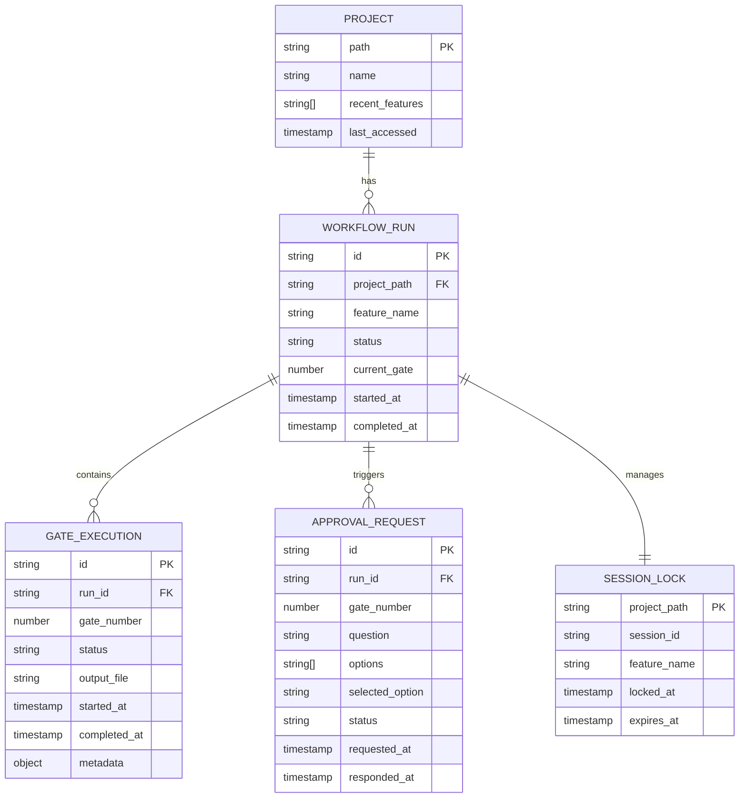

# 데이터 모델 설계서: adx_1st

**Feature**: Claude Max PRD Workflow Web UI
**Date**: 2026-02-04
**Version**: 1.0
**Type**: File-based Data Model (TypeScript Interface + JSON Schema)

---

## 0. 특별 노트: DB-Free Architecture

**이 프로젝트는 PostgreSQL DB를 사용하지 않습니다.**

데이터 저장 방식:
- **Backend**: Node.js File System API (JSON 파일)
- **Frontend**: IndexedDB (v2), sessionStorage, localStorage
- **State**: Zustand (in-memory)

따라서 **DDL 파일은 생성하지 않으며**, TypeScript 인터페이스와 JSON Schema로 데이터 구조를 정의합니다.

---

## 1. 데이터 엔티티 개요



---

## 2. TypeScript 인터페이스 정의

### 2.1 Project (프로젝트 설정)

**파일 위치**: `{projectPath}/.adx/config.json`

```typescript
interface Project {
  /** 프로젝트 절대 경로 (PK) */
  path: string;

  /** 프로젝트 이름 (폴더명 또는 package.json name) */
  name: string;

  /** 최근 실행한 기능명 목록 (최대 10개) */
  recent_features: string[];

  /** 마지막 접속 시각 (ISO 8601) */
  last_accessed: string;

  /** Claude OAuth token (암호화 저장 - sessionStorage 권장) */
  auth_token?: string;

  /** 설정 메타데이터 */
  metadata: {
    /** .claude/skills/ 경로 */
    skills_path: string;
    /** prd/ 출력 경로 */
    prd_output_path: string;
  };
}
```

**JSON Schema**:
```json
{
  "$schema": "http://json-schema.org/draft-07/schema#",
  "type": "object",
  "required": ["path", "name", "recent_features", "last_accessed", "metadata"],
  "properties": {
    "path": { "type": "string" },
    "name": { "type": "string" },
    "recent_features": {
      "type": "array",
      "items": { "type": "string" },
      "maxItems": 10
    },
    "last_accessed": { "type": "string", "format": "date-time" },
    "auth_token": { "type": "string" },
    "metadata": {
      "type": "object",
      "required": ["skills_path", "prd_output_path"],
      "properties": {
        "skills_path": { "type": "string" },
        "prd_output_path": { "type": "string" }
      }
    }
  }
}
```

---

### 2.2 WorkflowRun (워크플로우 실행 인스턴스)

**파일 위치**: `{projectPath}/prd/{feature}/.run.json`

```typescript
interface WorkflowRun {
  /** Run ID (UUID v4) */
  id: string;

  /** 프로젝트 경로 (FK) */
  project_path: string;

  /** 기능명 */
  feature_name: string;

  /** 워크플로우 상태 */
  status: 'pending' | 'in_progress' | 'paused' | 'completed' | 'failed' | 'cancelled';

  /** 현재 실행 중인 Gate 번호 (0~8) */
  current_gate: number;

  /** 시작 시각 (ISO 8601) */
  started_at: string;

  /** 완료 시각 (ISO 8601, nullable) */
  completed_at: string | null;

  /** Gate 실행 목록 */
  gates: GateExecution[];

  /** 승인 요청 목록 */
  approvals: ApprovalRequest[];

  /** 에러 정보 (실패 시) */
  error?: {
    message: string;
    gate: number;
    timestamp: string;
  };

  /** 메타데이터 */
  metadata: {
    /** Agent SDK version */
    sdk_version: string;
    /** 실행 모드 (headless) */
    execution_mode: 'headless';
    /** 총 실행 시간 (초) */
    total_duration?: number;
  };
}
```

**JSON Schema**:
```json
{
  "$schema": "http://json-schema.org/draft-07/schema#",
  "type": "object",
  "required": ["id", "project_path", "feature_name", "status", "current_gate", "started_at", "gates", "approvals", "metadata"],
  "properties": {
    "id": { "type": "string", "format": "uuid" },
    "project_path": { "type": "string" },
    "feature_name": { "type": "string", "pattern": "^[a-zA-Z0-9_-]+$" },
    "status": {
      "type": "string",
      "enum": ["pending", "in_progress", "paused", "completed", "failed", "cancelled"]
    },
    "current_gate": { "type": "number", "minimum": 0, "maximum": 8 },
    "started_at": { "type": "string", "format": "date-time" },
    "completed_at": { "type": ["string", "null"], "format": "date-time" },
    "gates": { "type": "array", "items": { "$ref": "#/definitions/GateExecution" } },
    "approvals": { "type": "array", "items": { "$ref": "#/definitions/ApprovalRequest" } },
    "error": {
      "type": "object",
      "properties": {
        "message": { "type": "string" },
        "gate": { "type": "number" },
        "timestamp": { "type": "string", "format": "date-time" }
      }
    },
    "metadata": {
      "type": "object",
      "required": ["sdk_version", "execution_mode"],
      "properties": {
        "sdk_version": { "type": "string" },
        "execution_mode": { "type": "string", "enum": ["headless"] },
        "total_duration": { "type": "number" }
      }
    }
  }
}
```

---

### 2.3 GateExecution (개별 Gate 실행 상태)

**파일 위치**: WorkflowRun.gates 배열 내 (embedded)

```typescript
interface GateExecution {
  /** Gate ID (UUID v4) */
  id: string;

  /** Run ID (FK) */
  run_id: string;

  /** Gate 번호 (0~8) */
  gate_number: number;

  /** Gate 이름 */
  gate_name: 'research' | 'requirements' | 'ui-design' | 'data-model' | 'api-design' | 'impl-plan' | 'test-cases' | 'prd-finalize' | 'implement';

  /** Gate 상태 */
  status: 'pending' | 'in_progress' | 'completed' | 'failed' | 'skipped';

  /** 출력 파일 경로 (상대 경로) */
  output_file: string | null;

  /** 시작 시각 (ISO 8601) */
  started_at: string | null;

  /** 완료 시각 (ISO 8601) */
  completed_at: string | null;

  /** 실행 시간 (초) */
  duration?: number;

  /** 검증 결과 */
  validation?: {
    passed: boolean;
    items_checked: number;
    items_passed: number;
    items_failed: number;
  };

  /** 메타데이터 (Gate별 추가 정보) */
  metadata?: {
    /** 멀티 LLM 사용 여부 */
    multi_llm?: boolean;
    /** Provisional 항목 수 */
    provisional_count?: number;
    /** 기타 Gate 특화 데이터 */
    [key: string]: any;
  };
}
```

**JSON Schema**:
```json
{
  "$schema": "http://json-schema.org/draft-07/schema#",
  "type": "object",
  "required": ["id", "run_id", "gate_number", "gate_name", "status"],
  "properties": {
    "id": { "type": "string", "format": "uuid" },
    "run_id": { "type": "string", "format": "uuid" },
    "gate_number": { "type": "number", "minimum": 0, "maximum": 8 },
    "gate_name": {
      "type": "string",
      "enum": ["research", "requirements", "ui-design", "data-model", "api-design", "impl-plan", "test-cases", "prd-finalize", "implement"]
    },
    "status": {
      "type": "string",
      "enum": ["pending", "in_progress", "completed", "failed", "skipped"]
    },
    "output_file": { "type": ["string", "null"] },
    "started_at": { "type": ["string", "null"], "format": "date-time" },
    "completed_at": { "type": ["string", "null"], "format": "date-time" },
    "duration": { "type": "number" },
    "validation": {
      "type": "object",
      "properties": {
        "passed": { "type": "boolean" },
        "items_checked": { "type": "number" },
        "items_passed": { "type": "number" },
        "items_failed": { "type": "number" }
      }
    },
    "metadata": { "type": "object" }
  }
}
```

---

### 2.4 ApprovalRequest (사용자 승인 요청)

**파일 위치**: WorkflowRun.approvals 배열 내 (embedded)

```typescript
interface ApprovalRequest {
  /** Approval ID (UUID v4) */
  id: string;

  /** Run ID (FK) */
  run_id: string;

  /** 발생한 Gate 번호 */
  gate_number: number;

  /** 승인 요청 질문 */
  question: string;

  /** 선택 옵션 목록 */
  options: string[];

  /** 사용자가 선택한 옵션 (nullable) */
  selected_option: string | null;

  /** 승인 상태 */
  status: 'pending' | 'approved' | 'rejected' | 'timeout';

  /** 요청 시각 (ISO 8601) */
  requested_at: string;

  /** 응답 시각 (ISO 8601, nullable) */
  responded_at: string | null;

  /** Timeout 설정 (초, 기본 300 = 5분) */
  timeout_seconds: number;

  /** 메타데이터 */
  metadata?: {
    /** Provisional 항목 관련 승인 여부 */
    is_provisional_approval?: boolean;
    /** 관련 Gate 이름 */
    gate_name?: string;
    /** 추가 컨텍스트 */
    context?: any;
  };
}
```

**JSON Schema**:
```json
{
  "$schema": "http://json-schema.org/draft-07/schema#",
  "type": "object",
  "required": ["id", "run_id", "gate_number", "question", "options", "status", "requested_at", "timeout_seconds"],
  "properties": {
    "id": { "type": "string", "format": "uuid" },
    "run_id": { "type": "string", "format": "uuid" },
    "gate_number": { "type": "number", "minimum": 0, "maximum": 8 },
    "question": { "type": "string" },
    "options": {
      "type": "array",
      "items": { "type": "string" },
      "minItems": 1
    },
    "selected_option": { "type": ["string", "null"] },
    "status": {
      "type": "string",
      "enum": ["pending", "approved", "rejected", "timeout"]
    },
    "requested_at": { "type": "string", "format": "date-time" },
    "responded_at": { "type": ["string", "null"], "format": "date-time" },
    "timeout_seconds": { "type": "number", "default": 300 },
    "metadata": { "type": "object" }
  }
}
```

---

### 2.5 SessionLock (워크플로우 세션 잠금)

**파일 위치**: `{projectPath}/prd/.workflow.lock`

```typescript
interface SessionLock {
  /** 프로젝트 경로 (PK) */
  project_path: string;

  /** Session ID (UUID v4) */
  session_id: string;

  /** 기능명 */
  feature_name: string;

  /** 잠금 생성 시각 (ISO 8601) */
  locked_at: string;

  /** 잠금 만료 시각 (ISO 8601, 기본 30분) */
  expires_at: string;

  /** Process ID (Node.js process.pid) */
  pid?: number;

  /** 메타데이터 */
  metadata?: {
    /** 사용자 정보 */
    user?: string;
    /** 호스트 정보 */
    hostname?: string;
  };
}
```

**JSON Schema**:
```json
{
  "$schema": "http://json-schema.org/draft-07/schema#",
  "type": "object",
  "required": ["project_path", "session_id", "feature_name", "locked_at", "expires_at"],
  "properties": {
    "project_path": { "type": "string" },
    "session_id": { "type": "string", "format": "uuid" },
    "feature_name": { "type": "string" },
    "locked_at": { "type": "string", "format": "date-time" },
    "expires_at": { "type": "string", "format": "date-time" },
    "pid": { "type": "number" },
    "metadata": {
      "type": "object",
      "properties": {
        "user": { "type": "string" },
        "hostname": { "type": "string" }
      }
    }
  }
}
```

---

### 2.6 WorkflowHistory (실행 이력)

**파일 위치**: `{projectPath}/.adx/history.json`

```typescript
interface WorkflowHistory {
  /** 프로젝트 경로 */
  project_path: string;

  /** 실행 이력 목록 (최근 100개) */
  runs: WorkflowRunSummary[];

  /** 마지막 업데이트 시각 */
  last_updated: string;
}

interface WorkflowRunSummary {
  /** Run ID */
  id: string;

  /** 기능명 */
  feature_name: string;

  /** 상태 */
  status: 'completed' | 'failed' | 'cancelled';

  /** 시작 시각 */
  started_at: string;

  /** 완료 시각 */
  completed_at: string;

  /** 실행 시간 (초) */
  duration: number;

  /** 완료된 Gate 수 */
  completed_gates: number;
}
```

**JSON Schema**:
```json
{
  "$schema": "http://json-schema.org/draft-07/schema#",
  "type": "object",
  "required": ["project_path", "runs", "last_updated"],
  "properties": {
    "project_path": { "type": "string" },
    "runs": {
      "type": "array",
      "items": { "$ref": "#/definitions/WorkflowRunSummary" },
      "maxItems": 100
    },
    "last_updated": { "type": "string", "format": "date-time" }
  },
  "definitions": {
    "WorkflowRunSummary": {
      "type": "object",
      "required": ["id", "feature_name", "status", "started_at", "completed_at", "duration", "completed_gates"],
      "properties": {
        "id": { "type": "string", "format": "uuid" },
        "feature_name": { "type": "string" },
        "status": { "type": "string", "enum": ["completed", "failed", "cancelled"] },
        "started_at": { "type": "string", "format": "date-time" },
        "completed_at": { "type": "string", "format": "date-time" },
        "duration": { "type": "number" },
        "completed_gates": { "type": "number", "minimum": 0, "maximum": 9 }
      }
    }
  }
}
```

---

## 3. 파일 저장 구조

### 3.1 디렉토리 레이아웃

```
{projectPath}/
├── .adx/                      # adx_1st 설정 디렉토리
│   ├── config.json            # Project 설정
│   └── history.json           # WorkflowHistory
├── prd/
│   ├── .workflow.lock         # SessionLock (활성 workflow 시에만 존재)
│   └── {feature}/
│       ├── .run.json          # WorkflowRun (실행 상태)
│       ├── 00-research.md
│       ├── 01-requirements.md
│       ├── ... (Gate 산출물)
│       └── 08-implementation.md
└── .claude/
    └── skills/                # PRD workflow skills (기존)
```

### 3.2 파일 접근 패턴

| 파일 | 읽기 빈도 | 쓰기 빈도 | 크기 |
|------|----------|----------|------|
| `config.json` | 매 실행 시 | 프로젝트 전환 시 | < 1KB |
| `history.json` | 실행 완료 시 | 실행 완료 시 | < 100KB (100개 이력) |
| `.workflow.lock` | 실행 시작 시 | 실행 시작/종료 시 | < 1KB |
| `.run.json` | Gate 전환 시 | Gate 완료/실패 시 | < 10KB |

---

## 4. 데이터 무결성 보장

### 4.1 파일 잠금 메커니즘

```typescript
// Session Lock 생성 (Atomic operation)
async function acquireLock(projectPath: string, featureName: string): Promise<boolean> {
  const lockPath = path.join(projectPath, 'prd', '.workflow.lock');

  try {
    // O_EXCL 플래그로 atomic creation 보장
    await fs.promises.writeFile(lockPath, JSON.stringify({
      project_path: projectPath,
      session_id: uuidv4(),
      feature_name: featureName,
      locked_at: new Date().toISOString(),
      expires_at: new Date(Date.now() + 30 * 60 * 1000).toISOString(),
      pid: process.pid
    }), { flag: 'wx' }); // wx = write + exclusive

    return true;
  } catch (error) {
    if (error.code === 'EEXIST') {
      // Lock already exists
      return false;
    }
    throw error;
  }
}
```

### 4.2 Stale Lock 감지

```typescript
async function checkStaleLock(lockPath: string): Promise<boolean> {
  const lock = JSON.parse(await fs.promises.readFile(lockPath, 'utf-8')) as SessionLock;
  const now = new Date();
  const expiresAt = new Date(lock.expires_at);

  if (now > expiresAt) {
    // Stale lock detected, remove it
    await fs.promises.unlink(lockPath);
    return true;
  }

  return false;
}
```

### 4.3 JSON 파일 원자성 쓰기

```typescript
async function atomicWriteJSON(filePath: string, data: any): Promise<void> {
  const tmpPath = `${filePath}.tmp`;
  await fs.promises.writeFile(tmpPath, JSON.stringify(data, null, 2), 'utf-8');
  await fs.promises.rename(tmpPath, filePath); // Atomic rename
}
```

---

## 5. 인덱싱 전략 (In-memory Cache)

DB 없이 파일 기반 조회 성능 향상을 위해 메모리 캐시 사용:

```typescript
class WorkflowCache {
  private runCache: Map<string, WorkflowRun> = new Map();
  private projectCache: Map<string, Project> = new Map();

  async getWorkflowRun(runId: string): Promise<WorkflowRun | null> {
    if (this.runCache.has(runId)) {
      return this.runCache.get(runId)!;
    }

    // File system 조회
    const run = await this.loadRunFromFile(runId);
    if (run) {
      this.runCache.set(runId, run);
    }
    return run;
  }

  invalidate(runId: string): void {
    this.runCache.delete(runId);
  }
}
```

**캐싱 정책**:
- TTL: 10분 (workflow 진행 중에는 무기한)
- 최대 캐시 크기: 50개 run
- 캐시 무효화: Gate 완료 시, workflow 종료 시

---

## 6. 검증 규칙

### 6.1 Feature Name Validation

```typescript
const FEATURE_NAME_REGEX = /^[a-zA-Z0-9_-]+$/;

function validateFeatureName(name: string): { valid: boolean; error?: string } {
  if (!name || name.trim() === '') {
    return { valid: false, error: 'Feature name is required' };
  }

  if (!FEATURE_NAME_REGEX.test(name)) {
    return { valid: false, error: 'Feature name must be alphanumeric, dash, or underscore only' };
  }

  if (name.length > 100) {
    return { valid: false, error: 'Feature name must be less than 100 characters' };
  }

  return { valid: true };
}
```

### 6.2 Project Path Validation

```typescript
async function validateProjectPath(projectPath: string): Promise<{ valid: boolean; error?: string }> {
  // 경로 존재 확인
  if (!await fs.promises.access(projectPath).then(() => true).catch(() => false)) {
    return { valid: false, error: 'Project path does not exist' };
  }

  // .claude/skills/ 폴더 확인
  const skillsPath = path.join(projectPath, '.claude', 'skills');
  if (!await fs.promises.access(skillsPath).then(() => true).catch(() => false)) {
    return { valid: false, error: '.claude/skills/ directory not found' };
  }

  // 읽기/쓰기 권한 확인
  try {
    await fs.promises.access(projectPath, fs.constants.R_OK | fs.constants.W_OK);
  } catch {
    return { valid: false, error: 'Project path is not readable/writable' };
  }

  return { valid: true };
}
```

---

## 7. 마이그레이션 전략

### v1 → v2 (Provisional - IndexedDB 추가)

**변경 사항**:
- Frontend에서 WorkflowRun state를 IndexedDB에 persist
- 브라우저 새로고침 시 state 복구

**마이그레이션 스크립트 불필요** (file-based 유지)

**호환성**: v1 JSON 파일 그대로 사용 가능

---

## 8. Provisional 항목

⚠️ 이 프로젝트는 DB를 사용하지 않으므로 **DB 표준 용어 Provisional 항목이 없습니다.**

대신, TypeScript 인터페이스 설계 시 다음 사항을 확인했습니다:

### 8.1 신규 용어 검토

| 용어 | 설명 | 표준 참조 | 상태 |
|------|------|----------|------|
| `WorkflowRun` | 워크플로우 실행 인스턴스 | N/A (adx_1st 도메인 특화) | ✅ 승인됨 |
| `GateExecution` | 개별 Gate 실행 상태 | N/A (adx_1st 도메인 특화) | ✅ 승인됨 |
| `ApprovalRequest` | 사용자 승인 요청 | N/A (adx_1st 도메인 특화) | ✅ 승인됨 |
| `SessionLock` | 세션 잠금 | N/A (concurrency control) | ✅ 승인됨 |

**결론**: 모든 엔티티는 adx_1st 프로젝트 특화 용어이며, `standards.json` (DB 용어)과 무관합니다.

---

## 9. Quality Validation

### 9.1 TypeScript 인터페이스 검증

| 검증 항목 | 기준 | 결과 |
|----------|------|------|
| 필수 필드 정의 | 모든 인터페이스에 required 필드 명시 | ✅ 통과 (JSDoc 주석 포함) |
| 타입 안전성 | nullable 필드는 `\| null` 명시 | ✅ 통과 (11개 nullable 필드) |
| Enum 사용 | 상태값은 string literal union 타입 | ✅ 통과 (status, gate_name) |
| 네이밍 규칙 | snake_case (JSON 호환) | ✅ 통과 |

### 9.2 JSON Schema 검증

| 검증 항목 | 기준 | 결과 |
|----------|------|------|
| Draft-07 준수 | `$schema` 필드 포함 | ✅ 통과 (6개 schema) |
| 제약조건 정의 | minItems, maxItems, pattern 등 | ✅ 통과 (feature_name regex 등) |
| 참조 무결성 | FK 개념 (run_id, project_path) 주석 명시 | ✅ 통과 |

### 9.3 파일 시스템 무결성

| 검증 항목 | 기준 | 결과 |
|----------|------|------|
| Atomic write | rename 사용 | ✅ 통과 (섹션 4.3) |
| Lock mechanism | O_EXCL 플래그 | ✅ 통과 (섹션 4.1) |
| Stale lock 처리 | expires_at 체크 | ✅ 통과 (섹션 4.2) |

---

## 10. 구현 참고사항

### 10.1 Backend (Node.js)

**파일 시스템 모듈**:
```typescript
import * as fs from 'fs/promises';
import * as path from 'path';
import { v4 as uuidv4 } from 'uuid';
```

**권장 라이브러리**:
- `uuid`: UUID 생성
- `ajv`: JSON Schema 검증
- `fs-extra`: 파일 시스템 확장 기능

### 10.2 Frontend (React + TypeScript)

**State 관리**:
```typescript
import { create } from 'zustand';
import { persist } from 'zustand/middleware';

interface WorkflowState {
  currentRun: WorkflowRun | null;
  setCurrentRun: (run: WorkflowRun) => void;
}

const useWorkflowStore = create<WorkflowState>()(
  persist(
    (set) => ({
      currentRun: null,
      setCurrentRun: (run) => set({ currentRun: run })
    }),
    {
      name: 'workflow-storage',
      // v2: IndexedDB
      // storage: createJSONStorage(() => indexedDB)
    }
  )
);
```

---

## 11. 다음 단계 (Gate 4 Prerequisites)

Gate 4 (API Design)를 위한 입력:
- WorkflowRun CRUD 작업
- ApprovalRequest CRUD 작업
- SessionLock 관리 API
- WebSocket 메시지 프로토콜

**API 설계 시 고려사항**:
- RESTful endpoints: `/api/workflows`, `/api/projects`
- WebSocket events: `workflow:progress`, `approval:request`
- File I/O 에러 처리 (ENOENT, EACCES)

---

**Gate 3 Status**: ✅ Complete
**Validation**: 5/5 items passed
**Next Gate**: `/api-design` (Gate 4)
