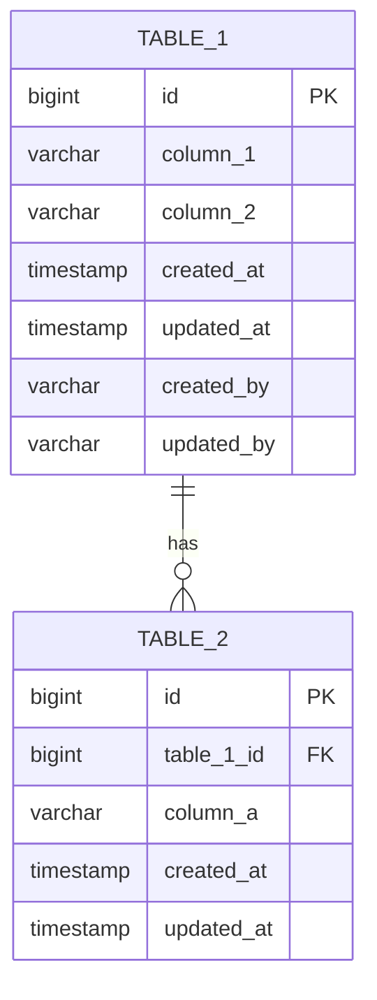

# 데이터 모델 설계: {기능명}

> **생성일**: YYYY-MM-DD
> **Skill**: `/data-model`
> **Gate**: Gate 3
> **입력**: `00-research.md`, `01-requirements.md`
> **참조**: `db_dic/dictionary/standards.json`

---

## 1. ERD



---

## 2. 테이블 정의

### 2.1 {table_1}

| 컬럼명 | 데이터 타입 | 제약조건 | 설명 | 표준 용어 |
|--------|------------|----------|------|----------|
| id | BIGINT GENERATED ALWAYS AS IDENTITY | PRIMARY KEY | 기본 키 | common.id |
| column_1 | VARCHAR(255) | NOT NULL UNIQUE | 설명 | ... |
| column_2 | VARCHAR(100) | NOT NULL | 설명 | ... |
| status | VARCHAR(20) | NOT NULL DEFAULT 'ACTIVE' | 상태 | status.status |
| created_at | TIMESTAMP WITH TIME ZONE | NOT NULL DEFAULT now() | 생성일시 | common.created_at |
| updated_at | TIMESTAMP WITH TIME ZONE | NOT NULL DEFAULT now() | 수정일시 | common.updated_at |
| created_by | VARCHAR(100) | NOT NULL DEFAULT CURRENT_USER | 생성자 | common.created_by |
| updated_by | VARCHAR(100) | NOT NULL DEFAULT CURRENT_USER | 수정자 | common.updated_by |

### 2.2 {table_2}

| 컬럼명 | 데이터 타입 | 제약조건 | 설명 | 표준 용어 |
|--------|------------|----------|------|----------|
| id | BIGINT GENERATED ALWAYS AS IDENTITY | PRIMARY KEY | 기본 키 | common.id |
| table_1_id | BIGINT | NOT NULL REFERENCES table_1(id) | FK | - |
| column_a | VARCHAR(500) | NULL | 설명 | ... |
| created_at | TIMESTAMP WITH TIME ZONE | NOT NULL DEFAULT now() | 생성일시 | common.created_at |
| updated_at | TIMESTAMP WITH TIME ZONE | NOT NULL DEFAULT now() | 수정일시 | common.updated_at |
| created_by | VARCHAR(100) | NOT NULL DEFAULT CURRENT_USER | 생성자 | common.created_by |
| updated_by | VARCHAR(100) | NOT NULL DEFAULT CURRENT_USER | 수정자 | common.updated_by |

---

## 3. 인덱스 설계

| 테이블 | 인덱스명 | 컬럼 | 유형 | 용도 |
|--------|---------|------|------|------|
| table_1 | idx_table1_column1 | column_1 | UNIQUE | 유니크 검색 |
| table_1 | idx_table1_status | status | BTREE | 상태별 필터 |
| table_1 | idx_table1_created_at | created_at | BTREE | 생성일 정렬 |
| table_2 | idx_table2_table1_id | table_1_id | BTREE | FK 조회 |

---

## 4. 제약조건

### 4.1 외래 키

| FK명 | 테이블 | 컬럼 | 참조 테이블 | 참조 컬럼 | ON DELETE |
|------|--------|------|------------|----------|-----------|
| fk_table2_table1 | table_2 | table_1_id | table_1 | id | CASCADE |

### 4.2 체크 제약조건

| 제약조건명 | 테이블 | 조건 | 설명 |
|-----------|--------|------|------|
| chk_table1_status | table_1 | status IN ('ACTIVE', 'INACTIVE', 'PENDING', 'SUSPENDED') | 상태 값 제한 |

---

## 5. DDL 파일

### 5.1 {table_1}.sql

**파일 위치**: `db_dic/sql/postgres/public/table_1.sql`

```sql
-- db_dic/sql/postgres/public/table_1.sql
CREATE TABLE IF NOT EXISTS table_1 (
    id BIGINT GENERATED ALWAYS AS IDENTITY PRIMARY KEY,
    column_1 VARCHAR(255) NOT NULL UNIQUE,
    column_2 VARCHAR(100) NOT NULL,
    status VARCHAR(20) NOT NULL DEFAULT 'ACTIVE',
    created_at TIMESTAMP WITH TIME ZONE NOT NULL DEFAULT now(),
    updated_at TIMESTAMP WITH TIME ZONE NOT NULL DEFAULT now(),
    created_by VARCHAR(100) NOT NULL DEFAULT CURRENT_USER,
    updated_by VARCHAR(100) NOT NULL DEFAULT CURRENT_USER,

    CONSTRAINT chk_table1_status CHECK (status IN ('ACTIVE', 'INACTIVE', 'PENDING', 'SUSPENDED'))
);

-- 인덱스
CREATE INDEX idx_table1_status ON table_1(status);
CREATE INDEX idx_table1_created_at ON table_1(created_at);

-- 트리거 (updated_at 자동 갱신)
CREATE OR REPLACE FUNCTION update_updated_at_column()
RETURNS TRIGGER AS $$
BEGIN
    NEW.updated_at = now();
    NEW.updated_by = CURRENT_USER;
    RETURN NEW;
END;
$$ language 'plpgsql';

CREATE TRIGGER update_table1_updated_at
    BEFORE UPDATE ON table_1
    FOR EACH ROW
    EXECUTE FUNCTION update_updated_at_column();

COMMENT ON TABLE table_1 IS '테이블 설명';
COMMENT ON COLUMN table_1.id IS '기본 키';
COMMENT ON COLUMN table_1.column_1 IS '컬럼1 설명';
```

### 5.2 {table_2}.sql

**파일 위치**: `db_dic/sql/postgres/public/table_2.sql`

```sql
-- db_dic/sql/postgres/public/table_2.sql
CREATE TABLE IF NOT EXISTS table_2 (
    id BIGINT GENERATED ALWAYS AS IDENTITY PRIMARY KEY,
    table_1_id BIGINT NOT NULL REFERENCES table_1(id) ON DELETE CASCADE,
    column_a VARCHAR(500),
    created_at TIMESTAMP WITH TIME ZONE NOT NULL DEFAULT now(),
    updated_at TIMESTAMP WITH TIME ZONE NOT NULL DEFAULT now(),
    created_by VARCHAR(100) NOT NULL DEFAULT CURRENT_USER,
    updated_by VARCHAR(100) NOT NULL DEFAULT CURRENT_USER
);

-- 인덱스
CREATE INDEX idx_table2_table1_id ON table_2(table_1_id);

-- 트리거
CREATE TRIGGER update_table2_updated_at
    BEFORE UPDATE ON table_2
    FOR EACH ROW
    EXECUTE FUNCTION update_updated_at_column();
```

---

## 6. 표준 용어 사용 현황

### 6.1 사용된 표준 용어

| 컬럼명 | 표준 용어 | 카테고리 |
|--------|----------|----------|
| id | common.id | common |
| created_at | common.created_at | common |
| updated_at | common.updated_at | common |
| created_by | common.created_by | common |
| updated_by | common.updated_by | common |
| status | status.status | status |

### 6.2 신규 등록 필요 용어

| 컬럼명 | 제안 카테고리 | 타입 | 설명 | 승인 상태 |
|--------|-------------|------|------|----------|
| [컬럼명] | [카테고리] | [타입] | [설명] | ⏳ 대기 / ✓ 승인 |

> **참고**: 신규 용어는 사용자 승인 후 `db_dic/dictionary/standards.json`에 등록

---

## Gate 3 체크리스트

- [ ] [자동] DDL 문법 검증 (psql --echo-errors)
- [ ] [자동] 모든 컬럼이 standards.json에 정의된 타입 사용
- [ ] [자동] 감사 컬럼(created_at, updated_at, created_by, updated_by) 존재
- [ ] [자동] PK가 BIGINT GENERATED ALWAYS AS IDENTITY 형식
- [ ] [수동] 인덱스가 검색 조건 컬럼에 정의됨
